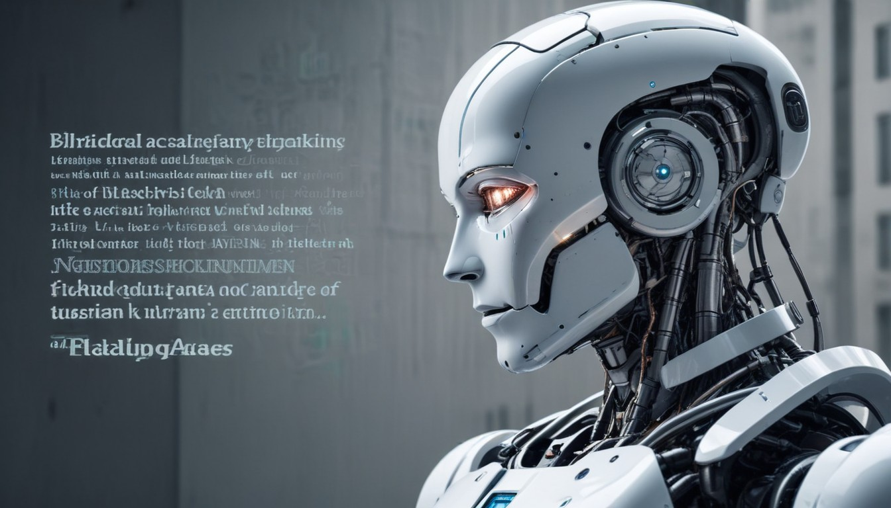
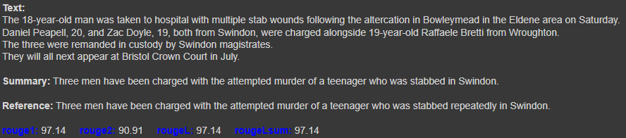
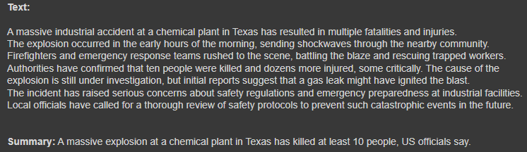
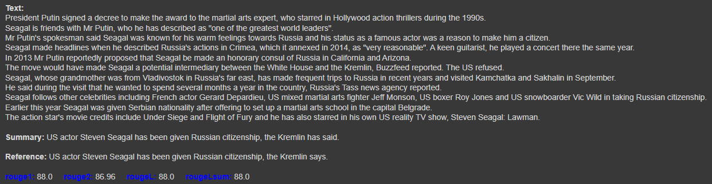
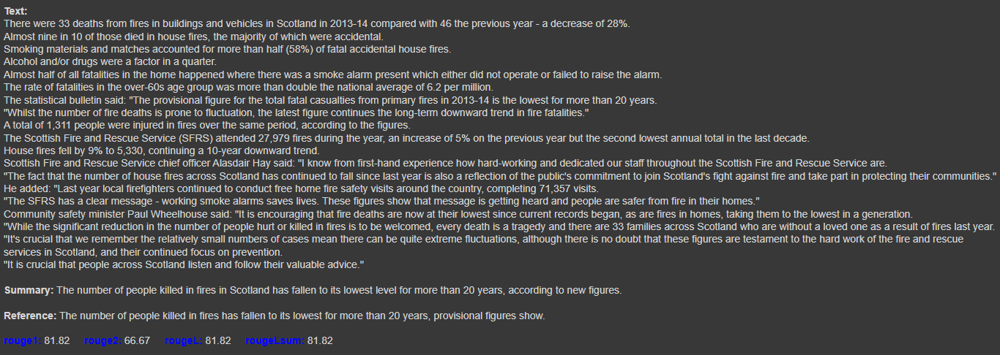
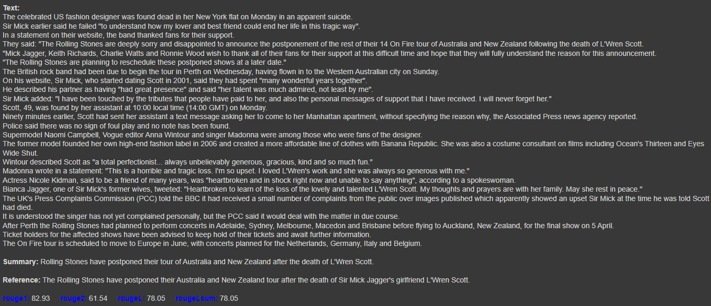

# <h1 align="center">**Summarization**</h1>

 

In this repository, text summarization models are implemented, a task within Natural Language Processing (NLP) that involves creating a shorter version of a document or article while capturing all essential information. Specifically, abstractive summarization models are developed to generate new text that synthesizes the most relevant information. These models are built using TensorFlow and Hugging Face.

The most important use cases include improving efficiency in reviewing large volumes of text, such as in academic research and legal document auditing. Additionally, these models are useful in customer service applications where long interactions need to be summarized for quick reference. They can also be used in journalism to create concise summaries of extensive news articles and in business information management to produce executive summaries that facilitate decision-making.

## **Implemented Models:**
- **Text Summarization with a Transformer Model:** This [sequence-to-sequence Transformer model](https://huggingface.co/learn/nlp-course/en/chapter1/7) is implemented from scratch, including its architecture, custom loss function, and optimizer. It is trained on the [Extreme Summarization (XSum) Dataset](https://huggingface.co/datasets/EdinburghNLP/xsum), which contains BBC news articles along with their corresponding concise summaries in a single sentence. The results on the validation dataset are: **`rouge1`: 27.66**, **`rouge2`: 8.51**, **`rougeL`: 22.27**, **`rougeLsum`: 22.28**.

- **Text Summarization with the [Text-To-Text Transfer Transformer (T5) model](https://huggingface.co/docs/transformers/model_doc/t5):** The [T5 Base](https://huggingface.co/google/t5-base) model is fine-tuned with the same XSum dataset to achieve better results and consequently higher text summarization quality. The results on the validation dataset are: **`rouge1`: 40.11**, **`rouge2`: 17.03**, **`rougeL`: 32.21**, **`rougeLsum`: 32.2**.

## **Some Results**

 

---

 

---

 

---

 

---

 

---

 

#### *More results can be found in the respective notebooks.*

## **Technological Stack**
 

## **Contact**

